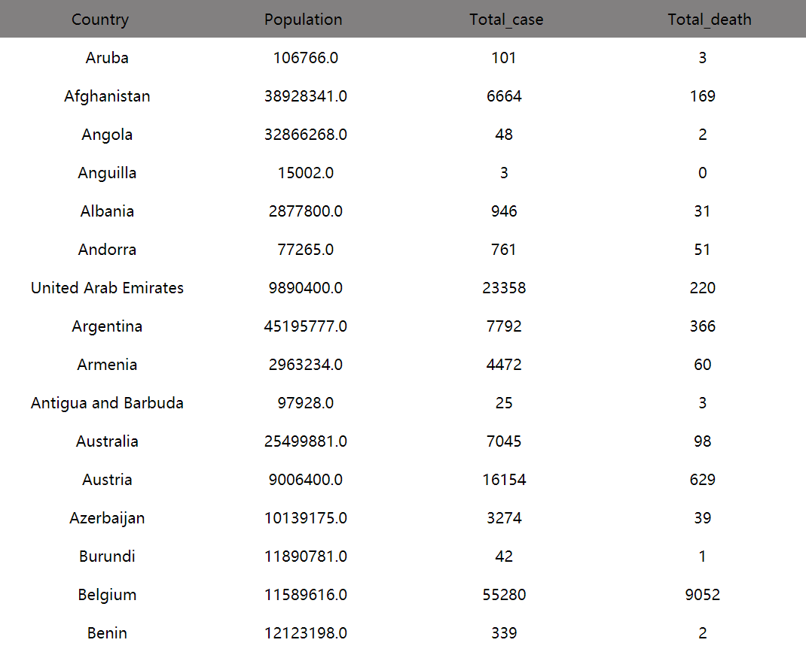

# @honmameiko/covid-19-datalist

Developed based on TypeScript and React.This component shows the latest Data in a format of list on COVID-19 (coronavirus) and will be updated daily.Check out the data source [Here](https://github.com/owid/covid-19-data/tree/master/public/data)

## Installation

``` node
npm install @honmameiko/covid-19-datalist
```

## Usage

``` javascript
import React from 'react'
import List from '@honmameiko/covid-19-datalist'
class  MyComponent extends React.Component{
  render(){
    <List />
  }
}
```

## SnapShot

